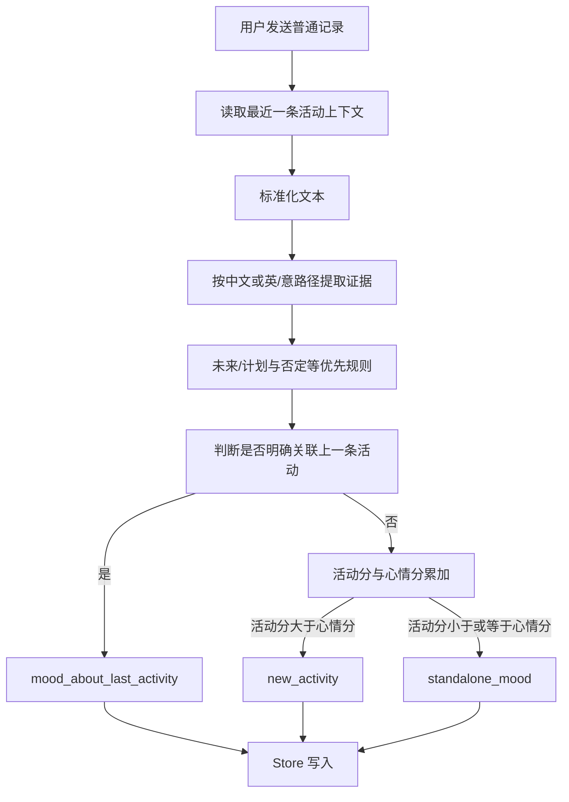

# DOC-DEPS: LLM.md -> docs/PROJECT_MAP.md -> docs/SEEDAY_DEV_SPEC.md -> src/features/chat/README.md
# 活动 / 心情自动识别规范

> 状态：当前有效（2026-07-16）  
> 适用范围：普通聊天记录输入，不包含魔法笔的复杂内容拆分。  
> 实现审计与开源方案见 `docs/ACTIVITY_MOOD_CLASSIFICATION_CURRENT_STATE.md`。

## 1. 产品口径

普通输入必须且只能得到以下三种内部结果：

| 内部结果 | 人话含义 | 最终写入 |
|---|---|---|
| `new_activity` | 用户正在做、刚做完或确实发生了一件事 | 活动消息 |
| `standalone_mood` | 用户主要在表达自己的状态或感受 | 独立心情消息 |
| `mood_about_last_activity` | 这份感受明确是在说上一条活动 | 心情消息，并关联上一条活动 |

没有“待确认”“无法识别”或第四种普通输入结果。分类器即使置信度低，也必须落到三者之一。

一句话同时出现活动词和心情词，不等于增加一个分类。例如“写周报写得很烦”同时提供活动证据和心情证据，但普通输入仍只选择一个最终结果。心情词可以成为计分证据，也可以被普通活动写入流程用于活动卡片的自动心情标签；它不是第四个路由出口。

## 2. 与魔法笔的边界

普通输入解决的是“整句话应该写成哪一种记录”，所以是三选一。

魔法笔解决的是“复杂文字里有几件事、每一段是什么”，AI 结构化输出继续保留四类：

- `activity`
- `mood`
- `todo_add`
- `activity_backfill`

魔法笔把同一句里的活动段和心情段分别提取后，可以用 `linkedMoodContent` 合并到活动草稿。这是复杂内容提取能力，不是普通分类器的第四种类型。

魔法笔的本地快速通道只处理证据清楚的单一意图。只要同一输入同时出现活动证据和心情证据，即使只有几个字，也必须交给魔法笔 AI 解析，不能因为“短”而直接写入。

## 3. 普通输入流程



关键入口：

- 页面：`src/features/chat/ChatPage.tsx`
- Store 编排：`src/store/chatActions.ts`
- 分类入口：`src/services/input/liveInputClassifier.ts`
- 最终计分：`src/services/input/resolver/liveInputResolver.ts`
- 类型定义：`src/services/input/types.ts`

## 4. 文本标准化

分类前会做以下处理：

1. 去掉首尾空白。
2. 合并重复空格。
3. 统一部分标点和大小写。
4. 判断是否只有标点或没有有效内容。
5. 保留用户原始文本用于展示和落库，标准化文本只用于判断。

只有标点或空内容仍必须分类，目前回落为低置信度 `standalone_mood`。

## 5. 证据来源

`evidence` 记录“为什么这样判断”，主要来源如下：

| 来源 | 例子 | 当前计分 |
|---|---|---:|
| `lexicon` | 跑步、开会、working、studying | 活动 +3 |
| `linguistic` 强结构 | `get up`、`go to school`、`visited Disneyland` | 活动 +3 |
| `linguistic` 短名词 | `Disneyland`、`Inception` | 活动 +1 |
| `linguistic` 心理关系 | `thinking about Disneyland` | 心情 +3 |
| `history` | 与最近 50 个已记录活动之一完全相同 | 活动 +3 |
| `goto_place` | at the library、去了公园 | 活动 +3；中文已发生外壳的额外证据 +1 |
| `ongoing` | 正在写、在吃饭 | 活动 +2 |
| `completion` | 写完、finished | 活动 +2 |
| `mood` | 累、开心、anxious | 心情 +2 |
| `future` | 明天要、later I will | 心情 +3，并优先拦截为非已发生活动 |
| `negation` | 没去、不想做 | 心情 +3，并优先拦截为非已发生活动 |
| 上下文心情偏置 | 明确评价上一条活动 | 心情 +3 |

同一句可以产生多条证据。总分公式是：

```text
activityScore = 所有活动证据分之和
moodScore = 所有心情、计划、否定和上下文证据分之和
```

普通输入的最终规则：

- `activityScore > moodScore`：`new_activity`
- `activityScore <= moodScore`：`standalone_mood`
- 在计分结束前，如果满足“明确关联上一条活动”的上下文规则：`mood_about_last_activity`

平分归心情是当前明确的保守回归规则，但仍属于三分类，不是“未识别”。

## 6. 上下文规则

除“关联上一条活动”外，上下文还会保留最近 50 个非心情活动的标准化文本。新输入只有与历史活动完全相同且自身没有心情证据时，才产生 `history` 活动证据；不做子串或模糊匹配，心理关系句不会被历史覆盖。


分类器最多读取最近一条活动，重点判断：

- 输入是否直接指代“刚才、那个、这次、it、that”等上一件事。
- 输入与上一条活动是否有可靠关键词重合。
- 输入是否包含评价或心情。
- 输入是否出现了足够强的新活动证据。

满足关联条件时，输出 `mood_about_last_activity` 并携带 `relatedActivityId`。如果只是碰巧包含相同的常用词，不能靠原始子字符串强行关联。

正在进行的活动还有一条写入规则：独立心情可以显式带上该活动的 ID，从而把心情备注定向挂到正在进行的活动；这不改变它的分类结果。

## 7. 多语言规则

### 中文

中文使用词库、活动句式、完成句式、去地点结构、心情词、计划/否定结构和短动作外壳。少于 4 个有效字符的非心情短句，只有满足动作外壳且没有计划、否定、提醒等信号时，才会回落为活动。

### 英语

英语使用：

- 活动与心情词库。
- 正则句式和时态外壳。
- 去地点结构。
- `compromise/two` 的词性、词根、缩写展开和语法模板匹配。

`compromise` 只提供结构证据，不直接决定最终结果。当前接入范围：

- `#Verb #Particle`：`get up / got up / wake up / woke up`。
- 移动词根 + 目的地：`go to school / went to school / I'm going to school`。
- 动作 + 对象：`visited Disneyland / buy veggies`。
- 位置短语：`at Disneyland`。
- 1 至 4 词的纯名词短语：`Disneyland / Inception / The Shawshank Redemption`，只给弱活动证据。
- 心理动词词根：`think / remember / remind / imagine / miss` 等，给心情证据并压住名词推断。
- 英语缩写中的将来和否定：`I'll... / I'm gonna... / didn't / haven't`。

同一个活动若已被词库、活动句式或地点规则覆盖，不再重复叠加普通语法活动分；短语动词保留独立回归证据。

### 意大利语

意大利语继续使用动词变形生成、词库、句式、完成信号和去地点结构。当前没有接入 `compromise`，避免把英语词性规则错误套到意大利语。

## 8. 写入规则

### new_activity

调用普通 `sendMessage(..., { skipMoodDetection: false })`。活动卡片的自动心情标签仍由现有普通心情检测负责；分类器里的混合心情证据不再触发一条专用写回通道。

### standalone_mood

调用 `sendMood()`。如果分类器明确给出正在进行活动的 `relatedActivityId`，Store 会定向关联。

### mood_about_last_activity

调用 `sendMood()` 并传入上一条活动 ID，心情消息仍独立存在，同时更新对应活动的关联信息。

## 9. 置信度

置信度由活动分与心情分的差值决定：

- 差值至少 3：`high`
- 差值 1 到 2：`medium`
- 差值 0：`low`

置信度用于魔法笔快速通道、遥测和后续评估，不会产生新的分类。

## 10. 纠错与评估

用户把最近消息在活动和心情之间转换时，系统记录纠错方向。评估必须按语言和场景分别看混淆矩阵，不能只看总准确率。

最低验收目标：

1. 固定 gold set 总准确率不低于 80%。
2. 英语短活动词和短语动词必须单独统计召回率。
3. 计划、否定、纯心情、纯活动、活动加心情证据、上一活动关联都要有测试。
4. 每个线上错误先加入回归集，再调整词库、结构证据或分数。
5. 普通分类的遥测字段只允许三个 `internalKind`。

## 11. 修改同步要求

修改本功能时至少检查并按需更新：

- `docs/ACTIVITY_MOOD_AUTO_RECOGNITION.md`：产品口径、计分和写入规范。
- `docs/ACTIVITY_MOOD_CLASSIFICATION_CURRENT_STATE.md`：当前代码审计与外部方案。
- `docs/ACTIVITY_LEXICON.md`：词库和语言结构证据。
- `docs/MAGIC_PEN_CAPTURE_SPEC.md`：快速通道与复杂拆分边界。
- `src/features/chat/README.md`：页面入口和交互职责。
- `src/store/README.md`：Store 路由和写入职责。
- `docs/PROJECT_MAP.md`：文档地图。
- `docs/CURRENT_TASK.md`、`docs/CHANGELOG.md`：会话状态与变更记录。
