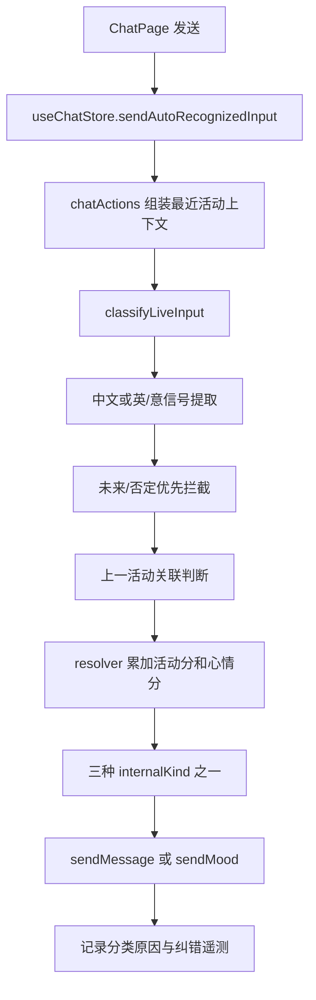

# DOC-DEPS: LLM.md -> docs/PROJECT_MAP.md -> docs/ACTIVITY_MOOD_AUTO_RECOGNITION.md -> docs/ACTIVITY_LEXICON.md
# 活动 / 心情分类当前实现审计与开源方案调研

> 审计日期：2026-07-24  
> 本文是工程现状/实现审计文档：描述当前代码真实行为、接线方式、风险和验证锚点。产品规范以 `docs/ACTIVITY_MOOD_AUTO_RECOGNITION.md` 为准。

## 1. 小白版结论

普通聊天输入现在只做三选一：

1. 这是一个新活动。
2. 这是一个独立心情。
3. 这是上一条活动过程中产生的心情。

系统没有“未识别”出口，也没有普通输入的“活动附带心情”第四类。一句话里即使同时有活动和心情，活动词与心情词只是分别加分，最后仍选三类中的一个。

魔法笔不同。它负责把复杂句拆开，所以 AI 仍保留 `activity / mood / todo_add / activity_backfill` 四类。魔法笔可以把拆出的心情段附到活动草稿，但这不需要普通分类器的第四种类型。

英语实时分类已接入 MIT 许可证的 `compromise/two`：除修复 `get up` 外，现在还使用词根、词性、缩写和语法模板识别目的地、动作对象、短名词及心理关系；英语 mood 句式前还接入了白名单拉长词归一化，用于兼容 `sooo good / reeeally tired / I feel goooood`。

## 2. 项目里其实有三种“分类”

| 层次 | 输入 | 输出 | 作用 |
|---|---|---|---|
| 实时输入意图 | 用户刚输入的一句话 | 普通输入三个 `internalKind` | 决定写活动还是心情 |
| 活动六分类 | 已经确定是活动的文本 | study/work/social/life/entertainment/health | 卡片颜色、统计和报告 |
| 心情标签 | 心情文字或活动文字 | happy/calm/down 等 `MoodKey` | 心情标签和报告 |

`get up` 的问题发生在第一层。后面的活动六分类或 AI 增强不会把一条已经错误写成心情的消息重新变成活动。

## 3. 普通输入的端到端流程

主要代码：

- `src/services/input/liveInputClassifier.ts`：总入口、语言路由、上下文优先规则。
- `src/services/input/signals/zhSignalExtractor.ts`：中文证据。
- `src/services/input/signals/latinSignalExtractor.ts`：英语和意大利语证据。
- `src/services/input/signals/englishLinguisticAdapter.ts`：`compromise` 短语动词证据。
- `src/services/input/resolver/liveInputResolver.ts`：统一计分和最终二选路由。
- `src/store/chatActions.ts`：把分类结果写成活动或心情。
- `src/features/chat/chatPageActions.ts`：魔法笔本地快速通道与 AI 分流。

## 4. 当前三种结果

结果定义、产品含义和正式写入口径以 `docs/ACTIVITY_MOOD_AUTO_RECOGNITION.md` 为准，这里只补当前代码里最容易误解的实现细节：

- `new_activity`：仍走 `sendMessage(..., { skipMoodDetection: false })`，所以混合句如“写周报写得很烦”虽然分类是活动，但活动卡片后续仍可能得到自动 mood tag。
- `standalone_mood`：无证据或平分也会落到这里；若最近活动仍在进行中，Store 可以额外带上 `relatedActivityId` 做定向备注，但分类结果不变。
- `mood_about_last_activity`：除了发送一条心情消息，还会把这条消息通过 `relatedActivityId` 写回上一条活动的 mood note / moodDescriptions。

## 5. 当前证据和分数

完整分值表以 `docs/ACTIVITY_MOOD_AUTO_RECOGNITION.md` 为准。当前实现层面新增或特别需要关注的证据有：

- 英语 grammar evidence：`phrasal_verb / motion_destination / action_object / location_phrase / bare_noun_phrase`，由 `compromise/two` 驱动。
- `history` evidence：最近 50 条非心情活动的精确标准化匹配，只加活动证据，不做模糊匹配。
- 英语 stretched-word mood evidence：`sooo / reeeally / goooood` 等白名单拉长词会先归一化，再进入既有的 mood sentence patterns。

置信度算法没有偏离规范：两边分差 `>= 3` 为 high，`1-2` 为 medium，`0` 为 low；低置信度仍只会落到现有三类之一。

## 6. 语言识别过程

### 中文

1. 标准化输入。
2. 检查未来、计划、否定和“事情没有发生”。
3. 检查正在进行、完成、去地点、活动词和心情词。
4. 检查是否在评价最近活动。
5. 对很短且没有心情的动作外壳做活动回落。
6. 进入统一 resolver 计分。

### 英语

1. 用词库和正则识别活动、心情、未来、否定、完成与地点。
2. 用 `compromise/two` 计算 POS 与 verb root，并读取缩写隐含的 `will / going to / #Negative`。
3. 匹配短语动词、移动目的地、动作对象和位置短语，记录为 `linguistic` 活动证据。
4. 对 1 至 4 词纯名词短语给 +1 弱活动倾向，使电影名、地点名不再直接 0:0 回落心情。
5. 主动词若是 think/remember/remind/imagine/miss 等心理关系词，改给 +3 心情证据并停止名词活动推断。
6. 心情句式匹配前，会对白名单口语拉长词做保守归一化：当前覆盖 `sooo / reeeally / veeery / quiiite / goooood / greeeat / happppy / tiiiired / saaad` 及相近重复形式；这一步只作用于 mood 匹配，不改活动语法、历史匹配和原始文本。
7. 最近 50 个已记录活动提供精确历史匹配；不做模糊匹配，也不覆盖心情证据。
8. 同一活动已有词库、句式或地点证据时，不重复叠加普通语法活动分。
9. 所有证据进入原有上下文规则和统一三选一计分。

已固定回归：`get up` 词形族、`go to school`、`visited Disneyland`、`Disneyland`、`Inception` 为 `new_activity`；将来、否定、`thinking about Disneyland`、`sooo good`、`reeeally tired`、`I feel goooood` 为 `standalone_mood`。

### 意大利语

使用意大利语词库、动词变形生成器、正则句式、完成和地点结构。当前没有套用英语 NLP 模型。

## 7. 魔法笔现在怎么分流

魔法笔先调用普通分类器，但只把它当作“是否可以本地快速写入”的判断工具。

以下情况不能走本地快速通道，必须调用魔法笔 AI：

- 同时有活动和心情证据。
- 有多个动作。
- 有待办清单信号。
- 有明确日期、时段或时间范围。
- 有列表分隔符或复杂标点。
- 普通分类器置信度不足。
- 命中提醒、计划、补录等魔法笔优先信号。

因此“吃饭”可以快速写入；“吃饭好开心”即使很短，也交给魔法笔拆分。

魔法笔 AI 四类不变：

- `activity`
- `mood`
- `todo_add`
- `activity_backfill`

若 AI 返回相邻的活动和心情，前端 draft builder 可以通过 `linkedMoodContent` 把心情附到活动草稿。普通分类器已经完全删除旧的专用混合类型。

## 8. 原问题为什么会发生，现如何修复

旧英语规则主要依赖人工词库、少量正则和短句模板。`get up`：

1. 不在活动词库。
2. 不命中原活动正则。
3. 没有心情词。
4. 没有可靠活动证据。
5. 最终 0:0 平分，按规则回落心情。

现在 `compromise` 会把它识别为“动词 + 小品词”的短语动词，产生 +3 活动证据，所以结果变为活动。这个修复同时覆盖词形变化，不需要分别硬编码六个短语。

## 9. 仍然存在的风险

1. `compromise` 只理解轻量英语语法，不理解产品意图；心理词根表、证据优先级和 gold set 仍由项目维护。
2. 规则和词库对网络新词、极短口语仍会漏；当前只对白名单中的英语拉长 mood 词做保守兼容，不对任意单词做全局压缩。
3. 短名词活动倾向会改善电影名和地点名召回，但也可能把其他名词误判为活动；当前只给 +1，并由心情证据优先压制。
4. 中文短动作外壳和英语短语动词都可能带来活动误报，必须靠 gold set 控制。
5. 用户纠错已经有遥测，但还没有稳定形成按语言分桶的训练闭环。
6. 当前 80% 目标必须由固定评估集证明，不能靠少量示例判断。

## 10. 已调研的免费可商用 GitHub 项目

“可商用”指仓库许可证允许商业使用；接入时仍须保留许可证声明，并单独核对数据集和模型许可证。

| 项目 | 许可证 | 能力 | 可放在产品哪个环节 | 结论 |
|---|---|---|---|---|
| [compromise](https://github.com/spencermountain/compromise) | MIT | 浏览器端 POS、verb root、缩写、动词短语和规则匹配 | 实时英语信号提取 | **已采用 `/two`**，覆盖短语动词、动作/目的地、短名词、心理关系、将来与否定 |
| [winkNLP](https://github.com/winkjs/wink-nlp) | MIT | token、POS、lemma、negation、sentiment | 替代或增强英语 linguistic adapter | 备选，不与 compromise 同时常驻 |
| [Open English WordNet](https://github.com/globalwordnet/english-wordnet) | CC-BY 4.0 | 词性、同义词、上下位关系 | 构建期扩活动词候选和检查漏词 | 推荐离线使用，必须署名 |
| [Natural](https://github.com/NaturalNode/natural) | 代码 MIT | tokenizer、stemmer、分类器、WordNet | Node 侧评估和词库生成 | 可用；内含数据需单独保留声明 |
| [WordPOS](https://github.com/moos/wordpos) | MIT | 基于 WordNet 的词性查询 | 构建期判断候选词是否可能是动词 | 可用，但不作为首选 runtime |
| [wink Naive Bayes Text Classifier](https://github.com/winkjs/wink-naive-bayes-text-classifier) | MIT | 轻量文本分类、交叉验证、混淆矩阵 | 有纠错样本后做三分类概率补充 | P1，先积累标注数据 |
| [NLP.js](https://github.com/axa-group/nlp.js) | MIT | 多语言 intent、实体、情感和语言识别 | 中英意统一的学习型分类实验 | P2，能力与现有规则重叠较多 |
| [fastText](https://github.com/facebookresearch/fastText) | MIT | 字符 n-gram、OOV 泛化、监督分类和量化 | 离线训练短文本三分类器 | P2，适合数据量更大后 |
| [spaCy](https://github.com/explosion/spaCy) | MIT | POS、lemma、dependency、textcat | 离线误判分析和 gold set 生成 | P2，不适合当前前端主链路 |
| [Transformers.js](https://github.com/huggingface/transformers.js) | Apache-2.0 | 浏览器/Node 模型推理 | 低置信样本二次判断 | P2/P3；模型许可证和体积需逐个审查 |
| [wink-sentiment](https://github.com/winkjs/wink-sentiment) | MIT | 情绪极性、强度和否定 | 只增强“有无心情”证据 | 辅助工具，不能单独区分活动 |
| [VADER](https://github.com/cjhutto/vaderSentiment) | MIT | 英语情绪强度 | 离线校验心情证据 | 辅助工具，Python 链路 |

明确不直接使用：

- NRC Emotion Lexicon 的免费条件不等于商业免费，商业产品需要另行确认授权。
- 没有 LICENSE 的 GitHub 词表不能因为“公开可下载”就进入商业产品。
- 开源推理框架的许可证不自动覆盖任意下载模型或训练数据。

## 11. 推荐的后续优化顺序

### P0：把 80% 变成可验证指标

1. 建立中英意固定 gold set，先达到每种语言 300 至 500 条。
2. 分桶统计纯活动、纯心情、混合证据、上一活动关联、未来、否定、极短输入和短语动词。
3. 每次线上纠错先进入回归集，再改规则。
4. 报告整体准确率、三类召回率和混淆矩阵。

### P1：离线扩词与轻量学习

1. 用 Open English WordNet 生成候选，不把整库打进 iOS。
2. 人工审核候选后再进入 `ACTIVITY_LEXICON`。
3. 用纠错样本训练 wink Naive Bayes 或 NLP.js 三分类基线。
4. 学习模型只提供分数，不绕过未来、否定和上下文硬规则。

### P2：数据足够后比较模型

比较 fastText、小型 Transformer 与当前规则组合。模型必须输出三类概率，仍由统一 resolver 合并；不能重新创造第四个普通输入类型。

## 12. 本次改动后的验证锚点

- 分类器单元测试：`src/services/input/liveInputClassifier.test.ts`
- 英语/意大利语回归：`src/services/input/liveInputClassifier.i18n.test.ts`
- Store 路由：`src/store/chatActions.test.ts`
- Store 集成：`src/store/useChatStore.integration.test.ts`
- 魔法笔分流：`src/features/chat/chatPageActions.test.ts`
- 固定意图集：`src/services/input/__fixtures__/liveInput.intent.fixture.json`
- PR0 评估：`npm run eval:classification:pr0`
