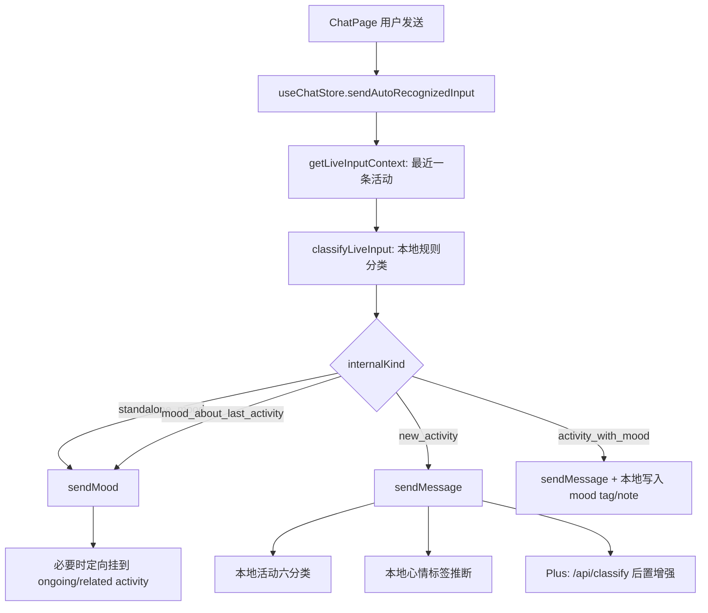

# DOC-DEPS: LLM.md -> docs/PROJECT_MAP.md -> docs/ACTIVITY_MOOD_AUTO_RECOGNITION.md -> docs/ACTIVITY_LEXICON.md
# 活动 / 心情分类当前实现审计与开源方案调研

- 文档性质：As-is 现状说明与技术选型调研，不是新的主计划
- 审计日期：2026-07-13
- 代码范围：聊天主输入、Magic Pen 快速路径、活动类别与心情标签后处理
- 外部项目核验日期：2026-07-13

## 1. 结论摘要

1. 聊天主输入的“活动还是心情”由前端本地规则完成，不由 AI 决定。
2. 当前英语实现依赖静态词库和大量正则，没有通用词性标注、词形还原、依存分析或短语动词识别。
3. 规则没有证据或活动分与心情分相等时，最终统一归为 `mood`。这是 `get up` 被判成心情的直接机制。
4. `get up` 不在英语活动词库，不命中英语活动正则，也不命中仅有的短句活动壳；最后得到 `activity=0, mood=0`，以 `ambiguous_default_to_mood` 落为低置信心情。
5. 后续 Plus AI 分类不会补救这次错误：它发生在活动已经写入以后，主要更新活动六分类、心情标签和瓶子匹配，不会把已写成 mood 的消息重新路由成 activity。
6. 现有自动基准只有 18 条活动/心情样本，没有英语短语动词样本；即使 18/18 通过，也不能代表真实英语准确率。
7. 最适合 Seeday 第一轮验证的是 `compromise` 或 `winkNLP` 二选一，为现有规则补充“确实存在英语动词/动词短语”的结构证据；不建议直接用大模型取代整个主链路。
8. Open English WordNet 适合在构建期扩充和校验词库；积累用户纠错数据后，可再用 wink Naive Bayes、NLP.js 或 fastText 训练产品自己的二分类器。

## 2. 现有文档及其边界

仓库已经有三份相关文档，但用途不同：

| 文档 | 实际用途 | 局限 |
| --- | --- | --- |
| `docs/ACTIVITY_MOOD_AUTO_RECOGNITION.md` | 产品目标、交互规则、技术方案和部分实现说明 | 同时保留了“建议”“Phase”等设计内容，不完全等于当前代码 |
| `docs/ACTIVITY_MOOD_AUTO_RECOGNITION_REFACTOR_PROPOSAL.md` | 2026-03 的问题分析和重构讨论稿 | 是历史讨论稿，部分建议已实现，部分没有 |
| `docs/ACTIVITY_LEXICON.md` | 多语言活动、心情、类别词库的维护说明 | 重点是词库 SSOT，不描述完整写入链路 |

本文只回答“当前生产代码实际上怎么做”，并在最后给出开源项目候选。产品目标仍以 `ACTIVITY_MOOD_AUTO_RECOGNITION.md` 为准。

## 3. 先区分产品里的三种分类

当前代码里“分类”至少有三层，不能混为一谈：

| 层 | 输入 | 输出 | 决定什么 |
| --- | --- | --- | --- |
| A. 实时输入意图分类 | 用户原始一句话 | `activity` / `mood`，以及 4 个 `internalKind` | 走 `sendMessage()` 还是 `sendMood()`；`get up` 的问题在这里 |
| B. 活动类别分类 | 已确定为活动的文本 | `study/work/social/life/entertainment/health` | 活动卡、统计和报告中的六分类 |
| C. 心情标签提取 | 活动文本或 mood note | 8 个 `MoodKey` | 活动附带的心情标签，不负责活动/心情路由 |

其中 A 层必须先完成。A 层一旦把输入写成 mood，B/C 层不会自动把它改回活动。

## 4. 主输入端到端流程



关键调用链：

1. `src/features/chat/ChatPage.tsx` 调用 `sendAutoRecognizedInput(text)`。
2. `src/store/useChatStore.ts` 转到 `sendAutoRecognizedInputFlow()`。
3. `src/store/chatActions.ts` 读取最近活动上下文，并调用 `classifyLiveInput()`。
4. `src/services/input/liveInputClassifier.ts` 执行语言路由、规则提取、证据计分和最终判定。
5. `src/store/chatActions.ts` 按 `internalKind` 分发到 `sendMessage()` 或 `sendMood()`。
6. 写入后记录分类原因、用户纠错和远程 telemetry。

## 5. A 层：活动 / 心情二分类规则

### 5.1 输出结构

公开结果只有两类：

- `kind: activity`
- `kind: mood`

内部再细分为：

- `new_activity`：新活动
- `activity_with_mood`：活动文本里同时有明确心情
- `standalone_mood`：独立心情
- `mood_about_last_activity`：明确评价最近一条活动的心情

结果还保留 `confidence`、`scores`、`reasons`、`evidence`、`relatedActivityId` 等调试和写入信息。

### 5.2 标准化

`normalizeLiveInput()` 当前会：

1. 去首尾空格并合并连续空格。
2. 过滤空文本和纯标点。
3. 统一部分中英文标点。
4. 移除部分中文句尾语气词。
5. 保留原始文本用于展示和落库，标准化文本只用于分类。

### 5.3 语言路由

1. 有拉丁字母且没有 CJK 字符时进入拉丁语言流程。
2. 拉丁语言流程根据一份人工维护的意大利语特征词表判断 `it`。
3. 没命中特征词就默认 `en`。
4. A 层不直接使用当前 UI 语言参数，因此极短、混合语言或英语/意大利语同形词仍可能误判语言。

### 5.4 英语信号提取

英语当前抽取以下布尔信号：

- `hasFuturePlan`：未来、计划或意图，如 `tomorrow`、`going to`、`want to`。
- `hasNegatedOrNotOccurred`：否定或未发生，如 `didn't work`、`nothing done`。
- `hasActivityLexicon`：活动静态词库命中。
- `hasActivityPattern`：活动正则命中。
- `hasMoodLexicon`：明确心情词命中。
- `hasMoodPattern`：心情句式正则命中。
- `hasStrongCompletion`：明确完成态命中。
- `hasGoToPlace`：有限的移动表达加地点词命中。

词库单词按 token 精确匹配，多词短语按标准化后的连续子串匹配。它不是通用语法解析器，也不会自动把 `got/getting/gets` 还原为 `get`。

### 5.5 早返回规则

拉丁语言流程按以下顺序处理：

1. 空文本或纯标点：低置信 `standalone_mood`。
2. 未来/计划且没有允许覆盖的活动结构或强完成态：高置信 `standalone_mood`。
3. 否定/未发生：高置信 `standalone_mood`。
4. 提取活动、完成态和心情证据并计分。
5. 有最近活动时，检查明确指代、强完成态或关键词重合；证据满足时改为 `mood_about_last_activity`。
6. 无活动和心情证据的 1 至 2 token 短句，若命中人工编写的 `EN_SHORT_ACTIVITY_SHELL_PATTERNS`，回退为中置信活动。
7. 其余交给统一 resolver；平分或零证据默认 mood。

### 5.6 当前计分

| 证据来源 | activity 加分 | mood 加分 |
| --- | ---: | ---: |
| future / negation | 0 | 3 |
| activity lexicon | 3 | 0 |
| ongoing / strong completion | 2 | 0 |
| go-to-place | 3（强化壳另加 1） | 0 |
| explicit mood / weak completion | 0 | 2 |
| context bias to last activity | 0 | 3 |

最终规则：

1. 同时存在活动证据和心情信号：`activity_with_mood`。
2. `activity > mood`：`new_activity`。
3. 其他情况，包括相等和 0:0：`standalone_mood`。

### 5.7 `get up` 的完整误判路径

| 步骤 | 结果 |
| --- | --- |
| 标准化 | `get up` |
| 语言 | 英语 |
| 未来/否定 | 均未命中 |
| 活动词库 | 未包含 `get up` |
| 活动正则 | 有 `woke up`，没有 `get up` |
| 心情词/句式 | 未命中 |
| 最近活动纠偏 | 无法产生活动证据 |
| 两词短句兜底 | 只支持少量 `verb + object` 模板，未覆盖 `verb + particle` |
| 分数 | `activity=0, mood=0` |
| 最终结果 | `mood / standalone_mood / low / ambiguous_default_to_mood` |

同一原因还会影响 `got up`、`getting up`、`wake up` 等未列出的词形和短语动词。`woke up` 恰好有专门正则，因此能命中活动；这种不一致也说明当前方案依赖人工枚举，而不是英语语言结构。

## 6. 分类后的写入规则

### 6.1 `standalone_mood`

调用 `sendMood()`。如果分类器给出正在进行活动的 `relatedActivityId`，心情消息仍独立落库，同时把 mood note 和自动 mood tag 定向写回该活动。

### 6.2 `mood_about_last_activity`

同样调用 `sendMood()`，但通过明确的 `relatedActivityId` 关联最近活动，避免仅凭“今天最后一条活动”猜测挂载。

### 6.3 `new_activity`

调用 `sendMessage()`，并发生以下副作用：

1. 关闭所有 ongoing 活动。
2. 创建新的 active record message。
3. 用本地关键词规则设置活动六分类，未命中默认 `life`。
4. 本地推断活动心情标签。
5. Plus 用户异步调用 `/api/classify`，更新活动类别、心情标签和瓶子匹配。
6. 触发批注、持久化和同步逻辑。

### 6.4 `activity_with_mood`

调用 `sendMessage(skipMoodDetection: true)`，随后使用分类结果或本地 fallback 写入 mood tag 和原始 mood note，避免重复跑一次普通心情检测。

### 6.5 Plus AI 的真实边界

`/api/classify` 的 prompt 也会返回 `kind: activity | mood`，但 `ensureMessageClassification()` 的调用时机在活动消息创建之后。当前 `sendMessage()` 只消费它的 `activity_type`、`mood_type` 和瓶子匹配结果，没有按 AI 的 `kind` 回滚 A 层路由。

因此它是“活动写入后的增强分类”，不是聊天主输入的活动/心情判定器。

## 7. Magic Pen 模式的关系

Magic Pen 不是完全独立的活动/心情分类器：

1. 先用同一个 `classifyLiveInput()` 做本地判断。
2. 简单输入且没有时间、提醒、未来或否定等解析优先信号时，直接走本地快速写入。
3. 只有复杂输入才进入 `parseMagicPenInput()` 和 `/api/magic-pen-parse`。

所以 `get up` 会先被本地判成 `standalone_mood`，又满足简单输入快速路径，通常不会获得 Magic Pen AI 解析的补救机会。

## 8. 纠错、埋点和测试现状

### 8.1 纠错

`reclassifyRecentInput()` 支持最近消息在 activity/mood 之间转换，并处理时间线和自动 mood 附着清理。用户纠错会记录 `activity->mood` 或 `mood->activity`。

### 8.2 Telemetry

当前会记录：

- 自动识别总数和 4 个 internal kind 的分布。
- 分类 reason/evidence 的频次。
- 用户纠错方向。
- 远程 live-input telemetry 事件。

这些数据已经具备训练轻量分类器的基础，但文档审计中没有看到“按语言、短语结构、线上纠错样本自动进入 gold set”的完整闭环。

### 8.3 测试和基准缺口

1. 单元测试数量不少，但英语样本主要来自现有词库和正则，容易验证已经知道的表达。
2. `liveInput.intent.fixture.json` 的活动/心情基准只有 18 条，每种语言 6 条。
3. 最新 `pr0-baseline.latest.json` 是 18/18；`PR0_BASELINE.md` 仍写 17/18，文档与产物已经漂移。
4. 没有 `get up`、`got up`、`wake up`、`sit down`、`head out`、`check in`、`log in` 等英语短语动词测试族。
5. 基准没有按“未知词、词形变化、短语动词、命令式、活动带心情、否定、未来、混合语言”分桶报告。

## 9. 根因归纳

英语误判不是只缺一个 `get up`，而是五个结构问题叠加：

1. 活动识别以人工词表和正则为主，维护成本随表达数量线性增长。
2. 没有词形还原，`get/got/getting`、`write/wrote/written` 要分别维护。
3. 没有短语动词或依存关系识别，`verb + particle` 容易整体漏掉。
4. 短句兜底只覆盖少量人工模板，不能泛化到开放英语。
5. 零证据和分数相等默认 mood，使“未知活动”系统性地变成心情。

## 10. 可免费商用的 GitHub 项目

以下“可商用”指仓库许可证允许商业使用；仍需保留许可证/版权声明，并核对随库下载的数据和模型许可证。

| 项目 | 许可证与成熟度 | 能力 | 在 Seeday 中的作用 | 建议 |
| --- | --- | --- | --- | --- |
| [compromise](https://github.com/spencermountain/compromise) | MIT；约 12k stars，长期维护；浏览器可运行 | 英语 POS、动词短语、词形变化、规则匹配、自定义词库 | 在 `latinSignalExtractor` 前增加通用动词结构证据，识别 `get up` 一类短句；约 250KB minified | **P0 首选 POC**，接入简单 |
| [winkNLP](https://github.com/winkjs/wink-nlp) + [English web model](https://github.com/winkjs/wink-eng-lite-web-model) | MIT；活跃维护；浏览器/Node/TypeScript | tokenization、POS、lemma、negation、sentiment、词向量；压缩模型约 1MB 起 | 作为更完整的英语信号提取层，输出 verb/lemma/negation，再映射成现有 evidence | **P0 对照 POC**，与 compromise 二选一 |
| [Open English WordNet](https://github.com/globalwordnet/english-wordnet) | CC-BY 4.0；2025 edition；允许商用但必须署名 | 英语名词、动词、形容词、副词、synset、上下位关系 | 构建期校验和扩充活动动词/短语、识别词性、生成候选同义表达；不建议整库进 iOS runtime | **P1 构建工具** |
| [Natural](https://github.com/NaturalNode/natural) | 代码 MIT；内含 Princeton WordNet 数据需保留其单独声明；约 11k stars | tokenizer、stemmer、classifier、WordNet、字符串相似度 | Node 侧词库生成、离线分类实验和基准工具 | 可用，但前端主链路不如前两项贴合 |
| [WordPOS](https://github.com/moos/wordpos) | MIT；基于 WordNet；发布较久 | 快速查询 noun/verb/adjective/adverb，v2 支持 browser | 构建期检查某词是否可能为动词/形容词；辅助发现词库漏项 | P1/P2；数据体积和维护活跃度不适合首选 runtime |
| [wink Naive Bayes Text Classifier](https://github.com/winkjs/wink-naive-bayes-text-classifier) | MIT；支持交叉验证和混淆矩阵 | 用已标注短文本训练 activity/mood 二分类 | 使用用户纠错和 gold set 训练轻量 fallback；规则无证据时提供概率 | **P1，在有足够标注数据后** |
| [NLP.js](https://github.com/axa-group/nlp.js) | MIT；支持 40 种原生语言 | intent classifier、sentiment、language ID、tokenizer/stemmer、实体提取 | 可把 activity/mood/internalKind 当 intent 训练，并扩展到中英意 | P2；能力全面但与现有模块重叠较多 |
| [fastText](https://github.com/facebookresearch/fastText) | MIT；约 26k stars；成熟但最新正式版较老 | 有监督文本分类、字符 n-gram、OOV/词形泛化、量化 | 用真实纠错语料训练高召回 activity/mood 模型；特别适合短文本和未登录词 | P2；更适合离线训练 + 服务端/原生推理 |
| [spaCy](https://github.com/explosion/spaCy) | MIT；约 33k stars；工业级 Python NLP | POS、lemma、dependency、textcat、规则 matcher | 离线分析误判、生成结构特征、构建 gold set；也能验证短语动词粒子关系 | P2 研究/离线工具；当前 TS/iOS 主链路接入成本高 |
| [Transformers.js](https://github.com/huggingface/transformers.js) | Apache-2.0；模型许可证必须另查 | 浏览器/Node 的 text classification、zero-shot、embedding | 仅对低置信样本做本地或服务端二次判断，或训练后部署专用小模型 | P2/P3；模型体积、首载、内存和许可证风险较高 |
| [wink-sentiment](https://github.com/winkjs/wink-sentiment) / [VADER](https://github.com/cjhutto/vaderSentiment) | 均为 MIT；前者 JS，后者 Python | 情感极性、强度、否定和部分表情符号 | 只增加“这句话确实有情绪”的证据，帮助避免把纯情绪判活动 | 仅作辅助；不能单独判断活动 |

## 11. 明确排除或需要额外审批的资源

1. [NRC Emotion Lexicon](https://www.saifmohammad.com/WebPages/AccessResource.htm) 研究用途免费，但商业产品需要商业许可证，因此不属于“免费可商用”候选。
2. 没有 LICENSE 的 GitHub 短语动词列表，即使公开可下载，也不能直接纳入商业产品。
3. `nlpcloud-js` 等客户端库即使是 MIT，其背后的云推理服务并不等于免费商用，不纳入本次首选。
4. Transformers.js、spaCy 等框架许可证合规，不代表任意 Hugging Face/spaCy 模型或训练数据都自动合规；模型必须逐个核验。

## 12. 推荐接入方案

### 第一阶段：结构证据补强

1. 在 `latinSignalExtractor.ts` 内增加一个可替换的英语 linguistic adapter。
2. 用 `compromise` 与 `winkNLP` 做同一批样本 POC，只保留一个依赖。
3. adapter 只输出结构化证据，例如 `hasVerbPhrase`、`verbLemma`、`hasParticle`、`isNegated`，不直接决定最终分类。
4. 对 1 至 4 token 且存在明确动词/动词短语、没有明确 mood 的输入，加活动证据。
5. 明确 mood 仍保留 mood 证据，例如 `get tired` 不能只因 `get` 是动词就强判活动。
6. 现有未来、否定和最近活动关联规则继续位于最终 resolver 前。

推荐新证据示例：

```ts
{
  source: 'linguistic',
  strength: 'strong',
  tokens: ['get', 'up'],
  reasonCode: 'matched_english_verb_phrase'
}
```

### 第二阶段：词库和测试闭环

1. 用 Open English WordNet 在构建期生成候选，不在运行时打包完整词库。
2. 先建立至少 300 至 500 条英语短输入 gold set，再决定阈值。
3. 必须分桶：短语动词、词形变化、命令式、单词活动、活动带心情、纯心情、否定、未来、上下文关联。
4. 为每个 lemma 建变体族测试，例如 `get up/got up/getting up/gets up`。
5. 基准同时报告 activity recall、mood precision、`mood->activity` 和 `activity->mood`，不能只看总准确率。

### 第三阶段：用纠错数据训练轻量分类器

1. 将用户明确纠错转成去标识化训练样本，建立语言和版本字段。
2. 先用 wink Naive Bayes 或 NLP.js 做可解释基线。
3. 数据量和质量足够后，再比较 fastText 或小型 Transformer。
4. 学习模型只处理规则低置信样本；高置信未来、否定、明确 mood 和明确活动仍走确定性规则。

## 13. 最终建议

最小风险路线是：

1. 不改变现有 store 写入契约和 `internalKind`。
2. 不靠继续手工追加 `get up` 一个词来结束问题。
3. 先在英语信号提取层引入 `compromise` 或 `winkNLP` 的动词结构证据。
4. 用 Open English WordNet 做构建期扩词和审查。
5. 先补真实英语 gold set，再根据用户纠错训练轻量 fallback。
6. 保留规则解释和 telemetry，让每次误判能回答“为什么被判成这一类”。

这条路线可以先解决 `get up` 所代表的整类英语结构缺失，同时不改变当前 iOS 优先、纯 TypeScript service、无主链路 AI 依赖的架构方向。
